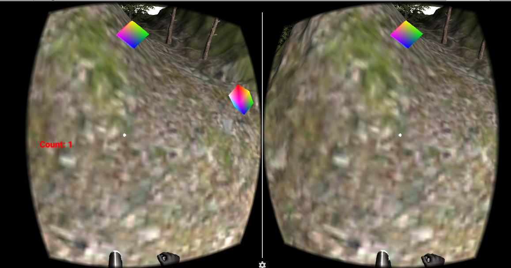

# UnityVrProject
Vr Game-The player when head below 60 degrees starts walking and when head is in upper position stops walking.Cubes have fragment shader and collision detection so that when you reach in the same position you pick one cube.When the player gets 5 of the cubes in the terrain he won!Realistic walking and turning animation of the player

